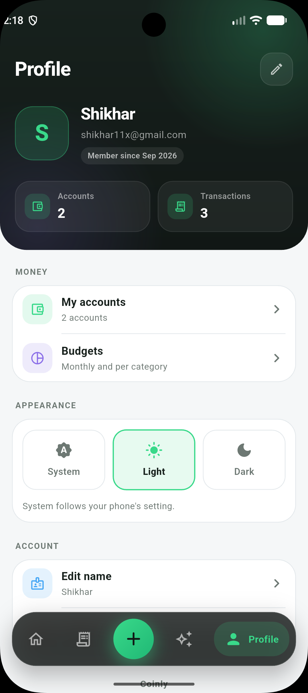
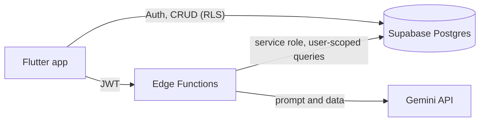

<div align="center">

# Coinly

**An AI-powered personal finance tracker built with Flutter and Supabase.**

Scan receipts, log expenses by voice, track budgets across multiple accounts, and ask questions about your own money in plain English, Hindi or Hinglish.


</div>

---

## Table of contents

- [Screenshots](#screenshots)
- [Features](#features)
- [Tech stack](#tech-stack)
- [Architecture](#architecture)
- [AI features and cost control](#ai-features-and-cost-control)
- [Security](#security)
- [Database](#database)
- [Project structure](#project-structure)
- [Getting started](#getting-started)
- [Configuration](#configuration)
- [Development](#development)
- [Known limitations](#known-limitations)
- [Roadmap](#roadmap)
- [Contributing](#contributing)
- [License](#license)
- [Acknowledgements](#acknowledgements)

---

## Screenshots

| Dashboard | Activity | Dark mode |
| :---: | :---: | :---: |
|  |  |  |

---

## Features

### Money tracking
- **Multiple accounts**: cash, bank, credit card, savings and wallet/UPI, with a default account and per-account balances. Negative balances (money owed) are supported.
- **Transactions**: income and expenses with categories, notes and dates. Search by note, category, account or amount, filter by type and period, swipe left to delete with an **Undo**.
- **Automatic balances**: account balances are kept correct by a database trigger, not by app code, so they stay consistent whichever way a transaction is created, edited or deleted.
- **Budgets**: one monthly budget plus optional per-category budgets, with progress rings and bars and a month-end spending projection ("At this pace: ₹6,100 by month end").
- **Dashboard**: total balance, income and spending, a donut chart by category, daily average and top category, with a **month switcher** to look at any past month.

### AI features
- **AI receipt scan**: photograph a bill and the amount, category, note and date are filled in for you to confirm.
- **Voice entry**: say *"spent 400 on groceries yesterday"* or *"kal grocery pe 400 kharch kiye"*. Works in English, Hindi and Hinglish, understands shorthand like `1.5k` and `2 lakh`.
- **AI assistant**: a chat that answers questions from your real transactions, budgets and accounts, for example *"Am I on track with my budget?"* or *"Compare this month with last month"*.
- **Per-user daily limits** so AI usage (and your bill) stays under control. See [AI features and cost control](#ai-features-and-cost-control).

### Product polish
- Light, dark and system themes (remembered between launches).
- Skeleton loading, empty and error states on every screen, pull to refresh, haptics and motion.
- Receipts, voice entries and manual entries are tagged, so each transaction shows how it was created.
- Responsive layout (content is width-limited on tablets and web).

---

## Tech stack

| Layer | Technology |
| --- | --- |
| App | Flutter, Dart 3, Material 3 |
| State management | Riverpod (`Notifier`, `FutureProvider`, family providers) |
| Navigation | go_router with auth-aware redirects |
| Backend | Supabase: Postgres, Auth, Row Level Security, Edge Functions (Deno / TypeScript) |
| AI | Google Gemini API (called only from Edge Functions) |
| Charts | fl_chart |
| Device features | image_picker, speech_to_text |
| Storage | shared_preferences (theme), flutter_dotenv (config) |

---

## Architecture



The app is organised by **feature**. Each feature owns its models, providers (state and data access) and screens:

- **Screens** only read providers and call repositories. They contain no SQL or API code.
- **Repositories** (for example `TxnRepo`, `AccountsRepo`, `BudgetRepo`) are the single place that writes to the database, and they invalidate the relevant providers afterwards so every screen refreshes.
- **Derived data** (month summaries, category totals, budget progress) is computed in providers from cached month queries, so each month is fetched once.
- **AI results never write to the database directly.** Receipt and voice results become a *draft* that pre-fills the normal transaction form, so the user always reviews before saving.

---

## AI features and cost control

All AI runs in Supabase Edge Functions. **The Gemini key never ships inside the app.**

| Function | Input | Output |
| --- | --- | --- |
| `parse-receipt` | Receipt photo (base64) and category names | amount, category, description, date |
| `parse-voice` | Transcript, category names, local date | type, amount, category, description, date |
| `assistant` | Question, short chat history, local date and timezone | answer and follow-up suggestions |

Every function follows the same pipeline:

1. **Validate** the request cheaply (size, type, length) before doing anything expensive.
2. **Identify the user** from the JWT (the `assistant` function verifies it with Supabase Auth).
3. **Consume one daily AI action** with a single atomic SQL call. The default limit is **30 per user per day**, resetting at midnight IST. Receipt, voice and assistant calls share the same allowance.
4. **Call Gemini** with a structured-output schema.
5. **Validate the model's answer** (amount range, known category only, plausible date) before returning it.
6. **Refund the action** if the failure was not the user's fault (network, Gemini outage, unreadable answer).

The `assistant` function does not hand raw tables to the model. It pre-computes month totals, per-category totals, budget usage, projections and the biggest expenses on the server, so the model explains numbers instead of adding them up.

---

## Security

- **Row Level Security on every table.** Users can only read and write their own rows. `user_id` is filled in by the database (`default auth.uid()`), never sent by the client.
- **Only the publishable (anon) key is in the app.** The secret / `service_role` key is used only inside Edge Functions, where Supabase injects it.
- **JWT verification is on** for all Edge Functions. The quota functions are executable only by the `service_role`.
- **Atomic quota counter**: concurrent requests cannot go over the limit.
- **Server-side data isolation**: the assistant filters every query by the verified user id.
- **Prompt-injection hardening**: transaction notes and receipt text are treated as data, never as instructions, and model output is validated before use.
- **Input limits** on image size, text length and category lists.

> The `.env` file is bundled into the app as an asset. Put **only** the Supabase URL and publishable key in it, and never commit it.

---

## Database

Defined in [`supabase/schema.sql`](supabase/schema.sql).

| Table | Purpose |
| --- | --- |
| `profiles` | Display name and currency, created automatically on sign-up by a trigger |
| `accounts` | User accounts with type, balance and default flag |
| `categories` | Built-in categories (`user_id is null`) plus optional custom ones |
| `transactions` | Income and expenses, with `input_method` (`manual`, `receipt_scan`, `voice`, `sms`) and the voice transcript |
| `budgets` | One overall budget (no category) and optional per-category budgets |
| `ai_usage` | Per-user, per-day AI action counter (readable by the owner, writable only by Edge Functions) |

Notable design decisions:

- A **trigger keeps account balances in sync** on insert, update and delete of a transaction.
- A **partial unique index** guarantees a user has at most one default account, and `set_default_account()` switches it atomically.
- `consume_ai_quota()` increments and checks the limit in **one statement**, and `refund_ai_quota()` gives an action back.

---

## Project structure

```text
lib/
├── main.dart                  # Boot: dotenv, Supabase, shared preferences
├── app.dart                   # MaterialApp.router, themes
├── core/
│   ├── router.dart            # go_router, auth redirects
│   ├── theme.dart             # Design tokens and light/dark ThemeData
│   ├── theme_mode.dart        # Persisted theme choice
│   ├── ui_kit.dart            # Shared widgets (cards, skeletons, buttons, motion)
│   ├── ui_helpers.dart        # Category icon/colour helpers, date labels
│   ├── working_dialog.dart    # "AI is working" dialog
│   ├── format.dart            # INR formatters
│   ├── nav.dart               # Selected tab state
│   └── supabase.dart          # Supabase client provider
└── features/
    ├── auth/                  # Login and sign-up
    ├── accounts/              # Accounts CRUD, default account
    ├── transactions/          # List, form, providers, month selection
    ├── budgets/               # Overall and per-category budgets
    ├── dashboard/             # Home screen
    ├── receipt/               # AI receipt scan flow
    ├── voice/                 # Voice entry flow
    ├── assistant/             # AI chat
    ├── profile/               # Profile, theme switch, logout
    └── shell/                 # Bottom navigation shell

supabase/
├── schema.sql                 # Tables, triggers, RLS, RPC functions
└── functions/
    ├── parse-receipt/index.ts
    ├── parse-voice/index.ts
    └── assistant/index.ts
```

---

## Getting started

### Prerequisites

- Flutter **3.27 or newer** (stable) with Dart 3
- A [Supabase](https://supabase.com) project (Postgres 15+, the default)
- A [Google AI Studio](https://aistudio.google.com/apikey) API key for Gemini
- Optional: the [Supabase CLI](https://supabase.com/docs/guides/cli) to deploy functions from the terminal

### 1. Clone and install

```bash
git clone https://github.com/shikhar11x/coinly.git
cd coinly
flutter pub get
```

### 2. Configure the app

```bash
cp .env.example .env
```

Fill in your Supabase project URL and **publishable (anon) key** from *Project Settings → API Keys*.

### 3. Set up the database

Open the Supabase **SQL Editor**, paste the contents of [`supabase/schema.sql`](supabase/schema.sql) and run it once on a fresh project.

For local development, turn **off** *Authentication → Providers → Email → Confirm email* so you can sign up without a confirmation link. Turn it back on before releasing.

### 4. Add the AI secrets and deploy the functions

In *Edge Functions → Secrets* add `GEMINI_API_KEY` (see [Configuration](#configuration) for the optional ones). Then deploy the three functions, either from the dashboard or with the CLI:

```bash
supabase login
supabase link --project-ref YOUR_PROJECT_REF
supabase secrets set GEMINI_API_KEY=your-key
supabase functions deploy parse-receipt
supabase functions deploy parse-voice
supabase functions deploy assistant
```

Keep **Verify JWT** enabled (the default).

### 5. Run

```bash
flutter run
```

### Platform permissions

**Android** (`android/app/src/main/AndroidManifest.xml`):

```xml
<uses-permission android:name="android.permission.RECORD_AUDIO" />
<uses-permission android:name="android.permission.INTERNET" />

<queries>
    <intent>
        <action android:name="android.speech.RecognitionService" />
    </intent>
</queries>
```

**iOS** (`ios/Runner/Info.plist`):

```xml
<key>NSCameraUsageDescription</key>
<string>Coinly uses the camera to scan receipts.</string>
<key>NSPhotoLibraryUsageDescription</key>
<string>Coinly reads a receipt photo that you choose.</string>
<key>NSMicrophoneUsageDescription</key>
<string>Coinly listens when you log a transaction by voice.</string>
<key>NSSpeechRecognitionUsageDescription</key>
<string>Coinly turns your speech into text to fill in a transaction.</string>
```

---

## Configuration

### App (`.env`)

| Variable | Description |
| --- | --- |
| `SUPABASE_URL` | Your project URL, `https://<ref>.supabase.co` |
| `SUPABASE_ANON_KEY` | The **publishable** (anon) key. Never use the secret / `service_role` key here |

### Edge Function secrets

| Secret | Required | Default | Description |
| --- | :---: | --- | --- |
| `GEMINI_API_KEY` | Yes | | Google AI Studio key |
| `GEMINI_MODEL` | No | `gemini-3.1-flash-lite` | Model for receipts and voice. Model names change, so check Google's model list |
| `ASSISTANT_MODEL` | No | falls back to `GEMINI_MODEL` | Model for the assistant, for example a more capable one |
| `AI_DAILY_LIMIT` | No | `30` | AI actions per user per day |

`SUPABASE_URL` and `SUPABASE_SERVICE_ROLE_KEY` are provided to Edge Functions automatically by Supabase.

---

## Development

```bash
flutter analyze        # static analysis
flutter run -d chrome  # quick iteration on web
```

Conventions:

- **Feature-first folders**; shared code lives in `lib/core`.
- **No database calls in widgets.** Reads go through providers, writes through repositories.
- **Colours and spacing come from the theme** (`AppColors`, `context.cs`, `context.muted`), so light and dark mode work everywhere.
- **Anything slow shows a skeleton and a clear error state**, never a bare spinner or a blank screen.

---

## Known limitations

- **Web is for development.** The camera opens a file picker on web, and speech recognition quality (especially Hindi) depends on the browser.
- **Free-tier AI privacy**: receipt images, voice transcripts and assistant data are sent to Google Gemini. Review Google's terms for the tier you use before handling other people's data.
- The Activity list loads the latest **500** transactions; the dashboard queries by month and is not affected.
- The assistant looks at the last 6 months of data, and chat history is kept only while the app is open.
- A budget amount applies to every month (no per-month budgets yet).
- No automated tests yet.

---

## Roadmap

- [x] Authentication, accounts, transactions, budgets
- [x] Dashboard with month switcher and insights
- [x] AI receipt scan and voice entry
- [x] Per-user daily AI limits
- [x] AI assistant chat
- [x] Dark mode
- [ ] Export transactions to CSV and PDF
- [ ] Recurring bills with reminders
- [ ] Savings goals
- [ ] Split expenses and shared accounts
- [ ] Bank SMS / UPI notification parsing (Android)
- [ ] Offline-first mode with sync
- [ ] Unit and widget tests for providers and flows
- [ ] CI with analyze and test checks

---

## Contributing

Issues and pull requests are welcome.

1. Fork the repository and create a branch: `git checkout -b feature/my-feature`
2. Make your change and run `flutter analyze`
3. Open a pull request describing what changed and why

---

## License

Released under the [MIT License](LICENSE).

---

## Acknowledgements

Inspired by the [Welth](https://github.com/piyush-eon/react-native-finance-platform) AI finance app by piyush-eon. Coinly is an independent Flutter implementation with a different architecture, UI and feature set.
